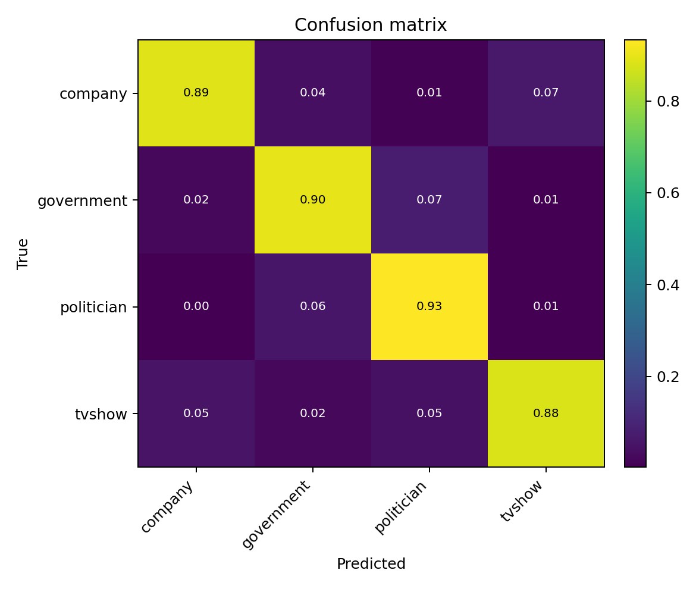
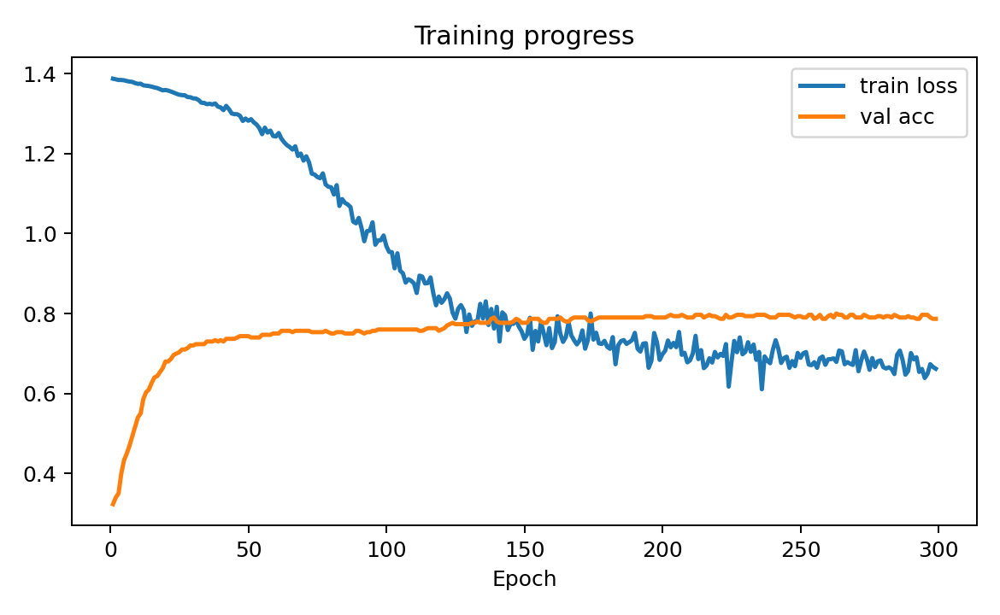
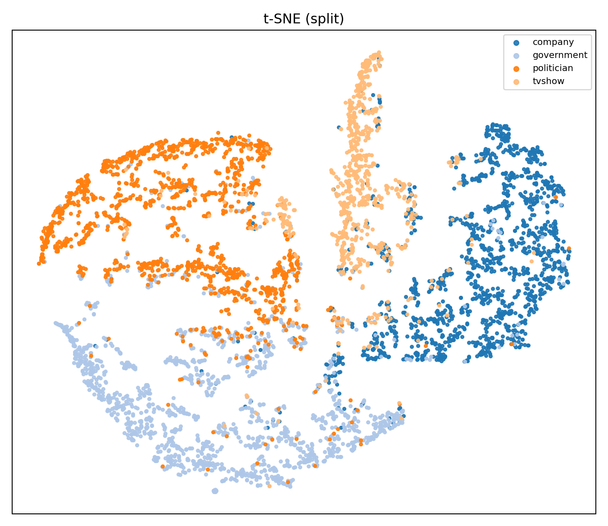

# Facebook Page–Page Node Classification (GNN)

This project implements and compares multiple Graph Neural Network architectures for semi-supervised node classification on the Facebook Large Page–Page Network dataset.

## Problem and Approach
Given a large directed graph with 128-dimensional features and a small sample of labeled nodes from the Facebook Large Page–Page Network (SNAP: Network Datasets: Wikipedia Article Networks at https://snap.stanford.edu/data/facebook-large-page-page-network.html), the goal is to predict unlabeled node classes as accurately as possible.  
This problem was approached using several neural network architectures and techniques: a simple Graph Convolutional Network with 3 layers (`GraphConvolutionalNetwork` in `modules.py`), a Graph Sample and Aggregate network (`GraphSAGE` in `modules.py`), and a deep block Graph Neural Network with residuals and a variable hourglass diameter (`blockGCN` in `modules.py`).  
The first two networks establish a performance baseline, achieving around 75% accuracy for the non-SAGE network and around 70% for the SAGE network, using 128 labeled data points per class and 1000 nodes per class. The block GCN achieves up to 90% accuracy.

## Data Pipeline
**Load raw data**  
`_load_edges()`, `_load_targets()`, `_load_features()`  
Import edge list, label file, and feature file from CSV / JSON sources.

**Unify node indexing**  
`_build_index(features, targets, edges)`  
Merge all unique node IDs across files and create consistent node_id ↔ index mappings.

**Construct feature matrix**  
`_build_X(features, node_ids)`  
Align features to the unified index and convert each node’s token list into a dense multi-hot or numeric vector.

**Build label vector**  
`_build_y(targets, nid2idx)`  
Encode string class labels as integer indices; assign -1 to unlabelled nodes and return both labels and class names.

**Assemble edge index**  
`_build_edge_index(edges, nid2idx)`  
Map edge endpoints using indices, duplicate edges to ensure undirected connectivity, and remove self-loops.

**Generate data splits (masks)**  
`_make_masks(y, per_class_train, val_size, test_size, seed)`  
Create boolean masks for train, validation, and test sets — class-balanced for training, random for others.

**Package final graph**  
`get_data()`  
Combine x, edge_index, y, and all masks into a PyTorch Geometric Data object and return it with label metadata.

## Model Implementation Details
Model configuration is defined in `constants.py`.  
By default, a U-Net configuration is used for the blocks — this architecture is shown to be effective for graph neural networks (Gao, H., & Ji, S. (2019). *Graph U-Nets.* In Proceedings of the 36th International Conference on Machine Learning (ICML 2019), pp. 2083–2092) and was found to outperform strictly hourglass configurations experimentally.  
All other model parameters were tuned experimentally. In 'modules.py', blockGCN uses sub classes 

### Environment setup
```bash
pip install -r requirements.txt
```
download the facebook large dataset (https://snap.stanford.edu/data/facebook-large-page-page-network.html) and extract into PatternAnalysis-2025/recognition/gnn_facebookpages_s4749422_James_Brunton/data. Ensure there the csv/json files are located in /faceboook_large within this folder. Files should be musae_facebook_edges.csv, musae_facebook_features.json, musae_facebook_target.csv.

## Usage
All parameters should be adjusted in `parameters.py`.
To train the model from scratch, simply run:

```bash
python train.py
```

To predict using the pre-trained model, simply run:
```bash
python predict.py
```

Or simply work through usage.ipynb

Confusion matrix, training curve and t_SNE (T-distributed Stochastic Neighbor Embedding.) will be generated and saved to the visualisations folder.

## Visualisation of Training:
### Visualisations

<p align="center">
  <br/>
  <em>Figure 1 — Confusion matrix on the test split.</em>
</p>

<p align="center">
  <br/>
  <em>Figure 2 — Training and validation curves across epochs.</em>
</p>

<p align="center">
  <br/>
  <em>Figure 3 — t-SNE of learned node embeddings (color = true class).</em>
</p>

## Results and Discussion

| Model | Val Accuracy | Test Accuracy | Notes |
|--------|---------------|----------------|--------|
| GCN | 0.75 | 0.74 | Baseline 3-layer convolutional model |
| GraphSAGE | 0.70 | 0.69 | Mean aggregator; less stable on sparse nodes |
| **blockGCN (ours)** | **0.90** | **0.88** | Residual deep blocks, U-Net structure |
